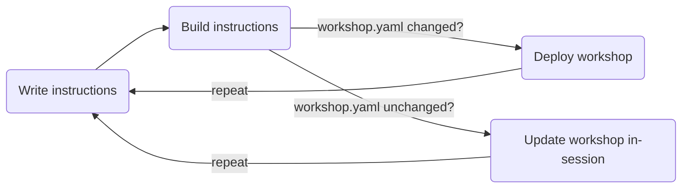

# Educates Workflow

We are now at a point where we can start building our own workshop! The workflow **writing, building, publishing,** and **deploying** workshops is heavily supported by the Educates CLI and the local Educates
platform we already spun up.

The workflow can be visualized like this:



But what happens in each stage?

## Writing Instructions

Educates' workshop instructions are written in **Markdown**. This allows for a great editing experience, especially when writing about technical topics. In the background, [Hugo](https://gohugo.io) is used to serve the Markdown documents as HTML pages from the workshop session in the web app.

## Building Instructions

When done writing, the instructions need to be **bundled and published** to a container registry as an **OCI image**.

**In your terminal**, the Educates CLI can take care of this process by publishing the workshop files to the registry spun up by Educates on `localhost:5000`:

```sh title="Publishing a workshop to the local Educates registry"
educates publish-workshop
```

For production, you will probably want to have some form of **CI/CD pipeline** building and publishing the OCI image and pushing it to a _real_ registry.

## Deploying a Workshop

Once the workshop is bundled and published to an OCI registry, we will need to **deploy it** to our Educates
platform.

We already learned that Educates manages deployed workshops via its `Workshop` CRD. Thus, we will
have to create and deploy a `Workshop` CustomResource to our cluster referencing the OCI image built from
our workshop's instructions.

Again, we can do so **from our terminals** using another built-in Educates CLI command:

```sh title="Deploying a workshop to the local Educates cluster"
educates deploy-workshop
```

This will create a `Workshop` CustomResource, push it to the cluster, and - if necessary - even create a `TrainingPortal` for us referencing the workshop in case there isn't any to begin with.

With all this theoretical knowledge in our heads, we can finally move on to create our own first workshop!

## Updating a Workshop

Once you start iterating over the instructions of an already existing workshop, you can get an even faster feedback loop than having to **publish, deploy,** and **restart** the workshop session in your browser:

As long as you only changed **content**, not the configuration of the workshop itself in 
`resources/workshop.yaml`, it's sufficient to just **publish changes** with `educates 
publish-workshop` and then pull the published resources into your running workshop session
using `update-workshop` from within your session's terminal.
