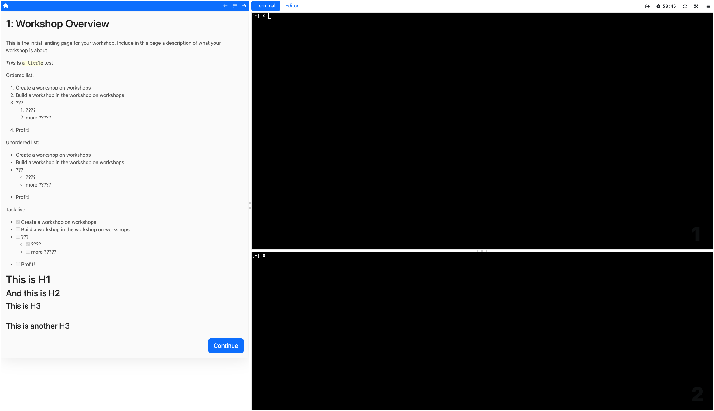

# Exploring a Workshop Session...

We managed to deploy our first workshop, and it's about time we had a look
at it from a user's perspective!

In the web app, click on **Start Workshop** and wait a few seconds for the
session to get started. You should end up in a web interface looking like this:

## ...From a User's Perspective

Take your time and look around! Explore the session using the terminal(s), and
get to know the environment your users will be using, too.

Things that might be of interest could be...

- ...what is the OS in use by the environment?
- ...what is my user called?
- ...am I root?
- ...what's in my home directory?
- ...what tools do I have available?

## From an Admin's Perspective

After getting to know the workshop environment from a user's perspective,
let's have a look at it from the admin's side, using `kubectl` from your
local terminal!

Here, try to find out...

- ...which pods have been spun up for the workshop session?
- ...how do they persist data?
- ...how is connectivity into the session via internet established?
- ...how do the pods start up?
- ...which other resources reside in the session's namespace?

Once you're done with your personal reconnaissance mission, **terminate your session**
in the top-right corner - it's time to learn about the features that make Educates
so great for interactive workshops!
